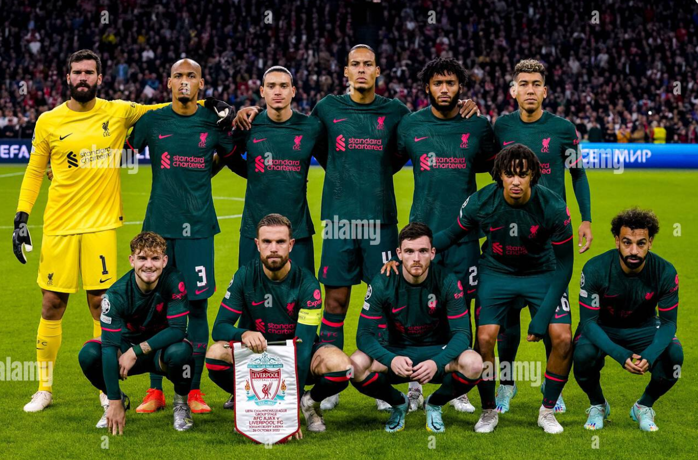
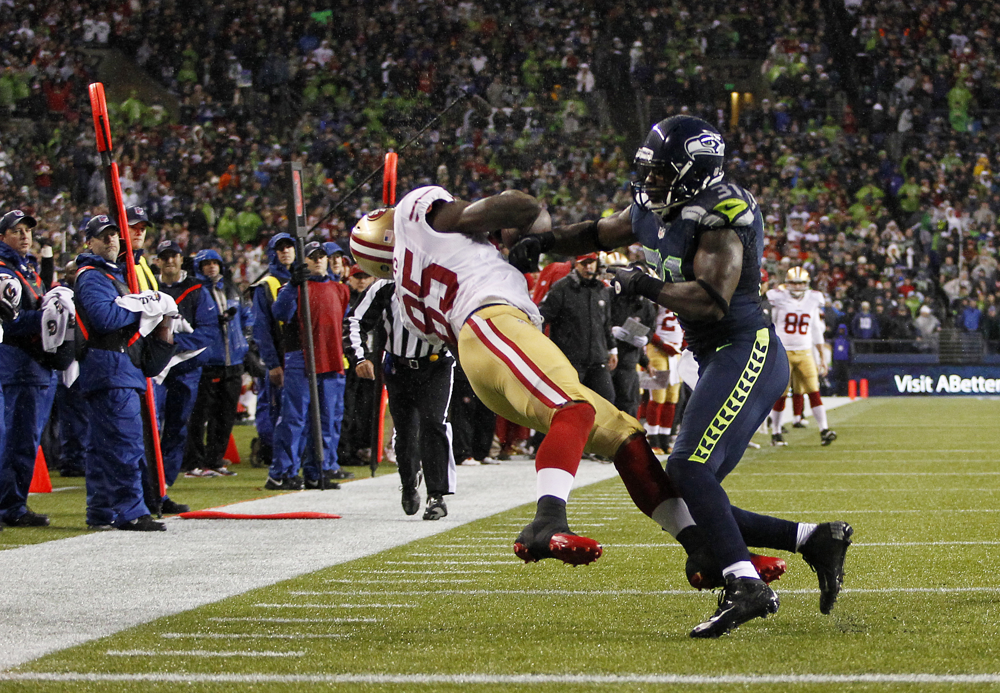
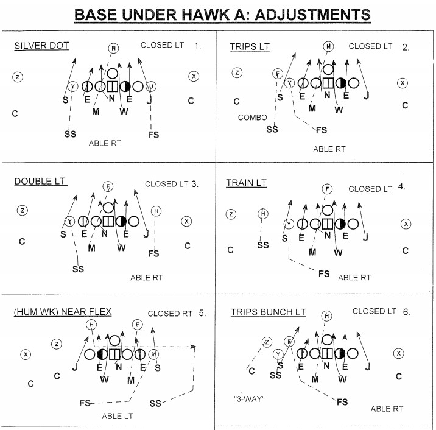

# Midterm-Test
Matt and Luci Practicing

<h1>Which "Football" Sport Reigns Supreme?<h1>
 
 

<h2>European football, the superior sport.<h2>

European football is one of the oldest sports in the world dating back to the 15th century, a good 300 years before American football. European football has the biggest fan base of any other sport, let alone American football. Many people argue over which sport should get the title of "football". Is can be a heated debate especially since Europeans have had to hear their beloved game being referred to as "soccer." However, European football deserves it's well earned nickname, "the beautiful game" 

European football has a rich history and tradition that goes back over hundreds of years. The oldest clubs in Europe have built a culture around the sport that has encapsulated the fans. This rich heritage makes the wins and losses feel personal for supporters, creating an emotional bond with their teams. The team rivalries in Europe are notorious for being colourful and passionate, adding another exciting aspect to the entertainment. 

In conclusion, European football embodies a rich history, a vibrant community, and a style of play that is celebrated worldwide. "The beautiful game," provides the excitement that draw millions of fans to stadiums and screens worldwide. European football deserves recognition not just for its name, but for the joy and connection it brings to people everywhere.

<h2>American Football, The Real Superior Sport<h2>

American Football is the superior Sport for many reasons. In fact, so many I will choose just a few to talk about. The first reason it is the better sport is due to its intensity. It's 60 minutes of guys trying to take each other's heads off (figuratively) and win the game for their team. Football players will leave blood on the field and be happy about it while soccer players will pretend like they tore their acl after the wind picks up. Football players will take hard hits all game and walk away like it's nothing. The games are just more action packed than soccer games. 

The next thing that makes it better is the exciting high scores. You can spend 90 minutes watching guys run up and down a field and the game ends 1-0 or even 0-0. Meanwhile you could spend 60 minutes watching an action packed, high flying, exhilarating sport that has games end with scores in the 20s-40s range. Nothing is better than seeing your favorite team drop 45 points on a team. It's an awesome feeling seeing your offense and defense dominate.

The last thing I’ll talk about is how tactical football actually is. Football Players on both sides of the ball need to remember hundreds of different plays. They spend hours every day learning the playbook in the offseason. They also have to continue studying it during the season as coaches are constantly changing their plays. Not to mention remembering how fakes and trick plays work the average NFL player needs to have a great memory and a fast memory. They need to remember how these plays are designed when they are said by the coach during the game. Not to mention the split second decisions a player has to make during the play. Where the man your guarding is gonna go, where the qb is throwing too, which receiver the qb should throw too, and so many, many more. The thought process and planning at every position from head coach to kicker is concise and seriously thought out. This is these guys careers and their passion and they are dead serious about being the best they can.
